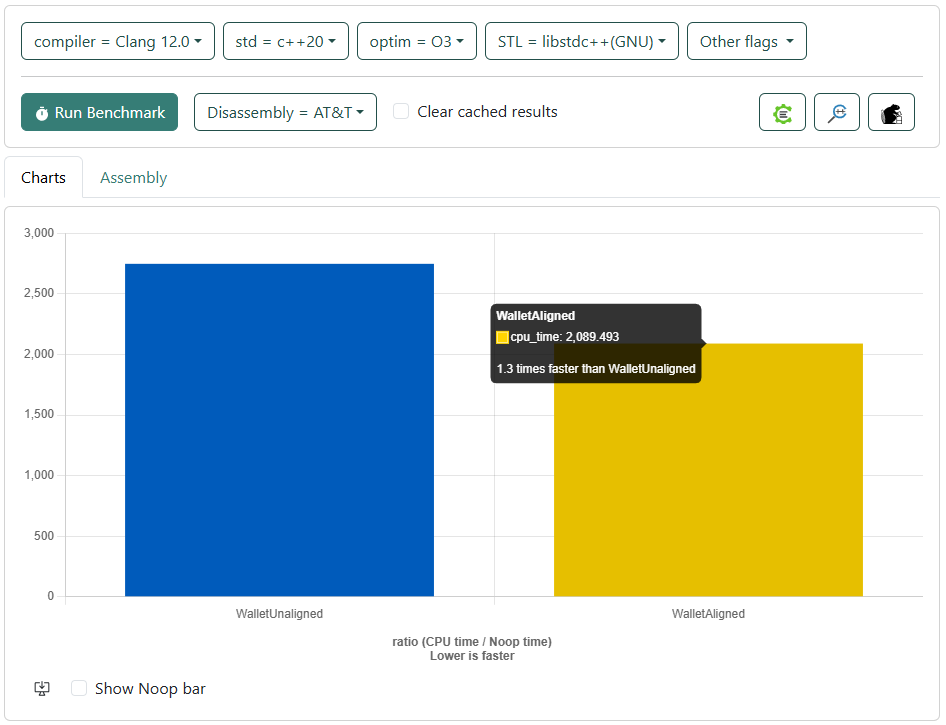

# Optimization techniques
table of contents
- [Profiling with gprof and optimized random number generation](#1-profiling-with-gprof-and-optimized-random-number-generation)
- [Multithreading](#2-multithreading)
- [Memory Alignment](#3-memory-alignment)
- [Other Optimizaion Techniques in Market Simulator](#4-other-optimizaion-techniques-in-market-simulator)

## 1.  Profiling with gprof and optimized random number generation

Profiling results from profile_report_gprof.txt revealed that 75% of the execution time was spent on random number generation using the Mersenne Twister engine. While it provides high-quality randomness, it is relatively slow. To improve performance, we replaced it with std::minstd_rand, a faster linear congruential generator that maintains the same accuracy.

After re-running gprof, the time spent on random number generation was reduced from 75% to 15%, significantly improving the efficiency of the Monte Carlo Simulation.

see [Profiling with gprof](optimization_documentation/gprof_Analysis/Profiling_with_gprof.md) for more details.

## 2. Multithreading

### How Our Threading Works
1. Each wallet runs as a separate async task
   - One future per wallet
   - No manual thread management needed
   - System handles thread creation/cleanup

2. Core Structure:
   ```cpp
   std::vector<std::future<void>> futures;
   for (size_t wallet_idx = 0; wallet_idx < wallets.size(); ++wallet_idx) {
       futures.push_back(std::async(std::launch::async, [&, wallet_idx]() {
           // Wallet simulation code
       }));
   }

3. Thread Safety Features
- Mutex protects price trend updates
- Local value calculation before mutex lock
- Safe random number generation per thread

### Why It's Faster Than Non-Threaded
1. Parallel Wallet Processing
   - Multiple wallets simulated simultaneously
   - Each wallet runs independently except for price updates
   - Utilizes multiple CPU cores

2. Efficient Resource Usage
   - Only shared data (price trends) needs mutex protection
   - Most calculations happen in parallel
   - Each wallet has its own local calculations

3. Example Performance:
   - Non-threaded: 4 wallets × 1000 simulations = 4000 sequential simulations
   - Threaded: 4 wallets running 1000 simulations each in parallel
   - Theoretical speedup: Up to 4x with 4 cores


## 3. Memory Alignment
- Code can be found in the [optimization_documentation/QBC_CEC_Analysis](optimization_documentation/QBC_CEC_Analysis) folder.

- *Idea: data types must be aligned with words or half words.* ([Lecture 11, slide 19](https://www.moodle.tum.de/pluginfile.php/5191043/mod_resource/content/6/advprog-lecture-optimization.pdf))

We evaluated the size of occpuied memory, the number of cachelines and number of holes for each class with the help of the [Compiler Explorer](https://compiler-explorer.com/). The codes which we used for these evaluations can be found in folder "optimization_documentation".

After reducing the size of occupied memory and eliminating holes where needed, we checked for each class whether the efficiency of the CPU time has increased or not. We used [Quick C++ Benchmark](https://quick-bench.com/q/r57JfkRd8B9x9fIWL_MHh0H_GqY) for evaluation. The result of the evaluation are shown in figures for each class.

### Stock class

- Doubles were changed into floats (half of size in memory, loss of precision and size of value is not crucial).
- The order of members was changed to eliminate holes and reduce the number of cachelines.
- Name was moved into chacline 2, because it's accesed less frequently than other members.

Compiler Explorer Code for Stock class: CEC_Stock_optimization.cpp

Before

```C++
class Stock {
	string                     _name;                /*     0    32 */
	double                     _ann_return;          /*    32     8 */
	double                     _daily_mean_return;   /*    40     8 */
	double                     _ann_volatility;      /*    48     8 */
	double                     _daily_vol;           /*    56     8 */
	/* --- cacheline 1 boundary (64 bytes) --- */
	int                        _risk_level;          /*    64     4 */

	/* XXX 4 bytes hole, try to pack */

	double                     _init_value;          /*    72     8 */
	class vector<double, std::allocator<double> > _price_trend; /*    80    24 */
	class normal_distribution<double> _dist;         /*   104    32 */

	/* XXX last struct has 7 bytes of padding */

    // public: ...

 	/* size: 136, cachelines: 3, members: 9 */
	/* sum members: 132, holes: 1, sum holes: 4 */
	/* paddings: 1, sum paddings: 7 */
	/* last cacheline: 8 bytes */
};
``` 

After

```C++
class Stock {
	class normal_distribution<double> _dist;         /*     0    32 */

	/* XXX last struct has 7 bytes of padding */

	float                      _init_value;          /*    32     4 */
	int                        _risk_level;          /*    36     4 */
	float                      _ann_return;          /*    40     4 */
	float                      _ann_volatility;      /*    44     4 */
	float                      _daily_mean_return;   /*    48     4 */
	float                      _daily_vol;           /*    52     4 */
	class vector<float, std::allocator<float> > _price_trend; /*    56    24 */
	/* --- cacheline 1 boundary (64 bytes) was 16 bytes ago --- */
	string                     _name;                /*    80    32 */

	// public: ...

	/* size: 112, cachelines: 2, members: 9 */
	/* paddings: 1, sum paddings: 7 */
	/* last cacheline: 48 bytes */
};
```

Quick C++ Benchmark code for Wallet: QBC_Stock_runtime.cpp


### 2. Wallet

- Use of int for identification instead of a string (former name).
- The order of members was changed to bring the unordered list and the double into cacheline 1 and have Strategy and the int in cachleine 2.
(- The double will not be changed into float if other classes are not optimized. Interaction between Wallet and other classes would result in float and double conversions.)

Compiler Explorer Code for Stock class: CEC_Wallet_optimization.cpp

Before
```C++
class Wallet {
	const string               _id;                  /*     0    32 */
	double                     _initial_investment;  /*    32     8 */
	class Strategy            _strategy;             /*    40    48 */

	/* XXX last struct has 4 bytes of padding */

	/* --- cacheline 1 boundary (64 bytes) was 24 bytes ago --- */
	class unordered_map<std::__cxx11::basic_string<char, std::char_traits<char>, std::allocator<char> >, double, std::hash<std::__cxx11::basic_string<char, std::char_traits<char>, std::allocator<char> > >, std::equal_to<std::__cxx11::basic_string<char, std::char_traits<char>, std::allocator<char> > >, std::allocator<std::pair<const std::__cxx11::basic_string<char, std::char_traits<char>, std::allocator<char> >, double> > > _stock_shares; /*    88    56 */

	// public: ...

	/* size: 144, cachelines: 3, members: 4 */
	/* paddings: 1, sum paddings: 4 */
	/* last cacheline: 16 bytes */
};
```

After
```C++
class Wallet {
	class unordered_map<std::__cxx11::basic_string<char, std::char_traits<char>, std::allocator<char> >, float, std::hash<std::__cxx11::basic_string<char, std::char_traits<char>, std::allocator<char> > >, std::equal_to<std::__cxx11::basic_string<char, std::char_traits<char>, std::allocator<char> > >, std::allocator<std::pair<const std::__cxx11::basic_string<char, std::char_traits<char>, std::allocator<char> >, float> > > _stock_shares; /*     0    56 */
	double                     _initial_investment;  /*    56     8 */
	/* --- cacheline 1 boundary (64 bytes) --- */
	class Strategy            _strategy;             /*    64    48 */

	/* XXX last struct has 4 bytes of padding */

	const int                  _id;                  /*   112     4 */

	// public: ...

	/* size: 120, cachelines: 2, members: 4 */
	/* padding: 4 */
	/* paddings: 1, sum paddings: 4 */
	/* last cacheline: 56 bytes */
};
```

Quick C++ Benchmark code for Wallet: QBC_Wallet_runtime.cpp



### Strategy

- Double were changed into float (half of size in memory, loss of precision and size of value is not crucial).
- Use of int for identification instead of a string (name).

Compiler Explorer Code for Stock class: CEC_Strategy_optimization.cpp

Before

```C++
class Strategy {
	string                     _name;                /*     0    32 */
	double                     _low_risk_alloc;      /*    32     8 */
	double                     _med_risk_alloc;      /*    40     8 */
	double                     _high_risk_alloc;     /*    48     8 */

    // public: ...

	/* size: 56, cachelines: 1, members: 4 */
	/* last cacheline: 56 bytes */
};
```

After

```C++
class Strategy {
	string                     _name;                /*     0    32 */
	float                      _low_risk_alloc;      /*    32     4 */
	float                      _med_risk_alloc;      /*    36     4 */
	float                      _high_risk_alloc;     /*    40     4 */

	// public: ...

	/* size: 48, cachelines: 1, members: 4 */
	/* padding: 4 */
	/* last cacheline: 48 bytes */
};
```

Quick C++ Benchmark code for Strategy: QBC_Strategy_runtime.cpp


## Conclusion

| Class    | Should we align data types? |
|:---------|:---------------------------:|
| Stock    | no                          |
| Wallet   | yes                         |
| Strategy | no                          |

# 4. Other Optimizaion Techniques in Market Simulator

## 1. **Precalculation Enhancements**
- **Volatility Adjustment**: The volatility adjustment process is now executed before running the simulation, significantly improving efficiency. Previously, volatility was recalculated during each simulation iteration, leading to redundancy. The following is now precomputed:

  ```cpp
  double daily_mean = stock.annual_return() / 252.0;
  double daily_vol = stock.annual_volatility() / sqrt(252.0);
  ```

  **Optimized Approach**: The necessary values are now precomputed in a more efficient manner by looping over the stocks:

  ```cpp
  for (auto& stock : stocks) {
      double total_stock_shares = total_shares[stock.name()];

      if (total_stock_shares > 0) {
          double base_coefficient{0.1};
          double adjustment_factor = 1.0 + base_coefficient * log(1.0 + total_stock_shares);
          stock.set_updated_annual_volatility(adjustment_factor);
      }
      stock.set_daily_mean_return();
      stock.set_daily_vol();
      stock.set_distribution(stock.daily_mean_return(), stock.daily_vol());
  }
  return 0;
  ```

  These updates were integrated into the `preparation` function in `MarketSimulator.cpp` within the `adjust_volatility` function. Additionally, unnecessary nested loops were replaced with more efficient data structures.

- **Optimized Risk Level Calculation**: The redundant loop for risk level calculation is now executed only once in the stock class constructor, reducing unnecessary computations:

  ```cpp
  void Stock::calculate_risk_level(const double& variance, int stock_counter[3]) {
      // 1: low risk, 2: medium risk, 3: high risk
      if (variance < 0.3) {
          _risk_level = 1;
          stock_counter[0]++;
      } 
      else if(variance < 0.6) {
          _risk_level = 2;
          stock_counter[1]++;
      }
      else {
          _risk_level = 3;
          stock_counter[2]++;
      }
  }
  ```

## 2. **Loop Unrolling and Efficiency Improvements**

- **Current Prices Initialization**: The initialization of `current_prices` has been optimized by removing redundant iterations.

  **Previous Approach**:
  ```cpp
  for (size_t i = 0; i < stocks.size(); ++i) {
      current_prices[i] = stocks[i].initial_value();
  }
  ```

  **Optimized Approach**: The stock price trend is now initialized within the stock object itself, reducing memory usage and eliminating unnecessary loops:

  ```cpp
  _name(name), _ann_return(ann_return), _ann_volatility(ann_volatility), 
  _risk_level(risk_level), _init_value(init_value), _price_trend(price_trend) {
      if (_price_trend.empty()) {
          _price_trend.push_back(_init_value);
      }
  }
  ```

  The stock class now automatically updates its price trend, avoiding the need for additional loops.

- **Stock Allocation Optimization**: Stock allocation calculations are now performed more efficiently by creating the stock objects in a single loop within `main.cpp`:

  **Previous Approach**:
  ```cpp
  for (auto& wallet : wallets) {
      total_initial_investment += wallet.initial_investment();
      for (auto& stock : stocks) {
          double allocation{0.0};
          switch (stock.risk_level()) {
              case 1: // Low risk
                  allocation = low_risk_count > 0 ? wallet.strategy().low_risk_allocation() / 100.0 / low_risk_count : 0;
                  break;
              case 2: // Medium risk
                  allocation = med_risk_count > 0 ? wallet.strategy().medium_risk_allocation() / 100.0 / med_risk_count : 0;
                  break;
              case 3: // High risk
                  allocation = high_risk_count > 0 ? wallet.strategy().high_risk_allocation() / 100.0 / high_risk_count : 0;
                  break;
          }
      }
  }
  ```

  **Optimized Approach**:
  Stock initialization and risk level calculation are handled in a single loop:

  ```cpp
  std::vector<Stock> stocks;
  for (size_t i = 0; i < stock_names.size(); ++i) {
      Stock stock(stock_names[i], expected_returns[i], 0, 0, initial_values[i]);
      stock.calculate_risk_level(variances[i], stock_counter);
      stock.calculate_volatility(variances[i]);
      stocks.push_back(stock);
  }
  ```

## 3. **Encapsulation and Modularization**

- Consolidated logic into the `MarketSimulator::Preparation()` method, replacing the `prepareStockAllocations()` function, enhancing modularity and clarity.
- Integrated preparation, simulation, and output phases into a unified `runSimulator()` method, streamlining the simulation process and improving organization.
- Moved the distribution initialization outside of loops to avoid redundant reinitializations:

  ```cpp
  std::normal_distribution<double> dist(daily_mean, daily_vol);
  ```
