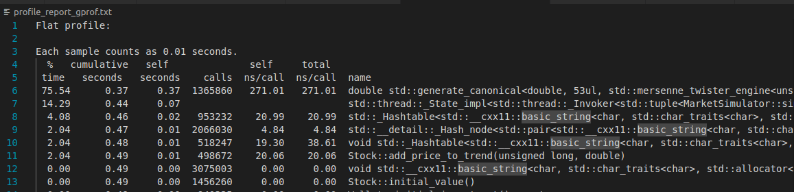
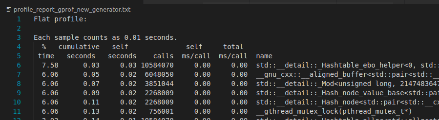

# Profiling with gprof

`gprof` is a profiling tool that helps identify bottlenecks, and optimize the most time-consuming functions.

If you know how to run gprof skip to part 4 for the results!

## 1. Install `gprof`

   ```bash
   sudo apt update && sudo apt install binutils
   ```
## 2. Build the project

The `CMake lists.txt` has the `-pg` flag which compiles the program with profiling support
```cmake
set(CMAKE_CXX_FLAGS "-pg ${CMAKE_CXX_FLAGS}")
```
Now, build the file as usual and run the program
```bash
cmake ..
make
./group_80
```

## 3. Run gprof to analyze the program


Run grpof on gmon.out, whcih had the profiling data, and save output to a txt file

```bash
gprof group_80 gmon.out > profile_report.txt
```
## 4. Results

In `profile_report_gprof.txt` we observe that 75% time gets spent to generate random numbers for the Monte Carlo Simulation. We used the Mersenne Twister engine for generating random numbers. It is known for being high quality but can be slower. We tested the code with `std::minstd_rand` ,a faster linear congruential generator which yields the same accuracy!. 

After running gprof again, we brought down the time spent for random generation from 75% to 15%! 


